# Mini-React

通过实现简易的一个 React，达到理解 React 的相关理念，懂得为何要如此处理，从而在工作中能更加得心应手。

## 在页面中呈现 app

- [x] 通过 DOM API 呈现要展示的 app 字段
- [x] 将 vdom 对象抽离，dom 渲染写死
- [x] 通过 vdom 动态生成 dom
- [x] 将代码重构成 React API

最终目标：`ReactDom.createRoot(document.querySelector('#root')).render(<App />)`

通过上述代码我们可以知道，`ReactDom` 是一个对象，具有 `createRoot` 方法，该方法接收一个渲染容器，该方法的返回值是一个具有 `render` 方法的对象，`render` 接收一个 `App ` (JSX这里暂时忽略) ，并将该 `App` 内容渲染到容器中去。

首先我们可以通过 `DOM API` 先将 `app` 显示在页面中，然后按照上述步骤一步一步最终实现目标。

### 通过 DOM API 渲染出 app 字段

这里我们直接使用 DOM API 实现如下：

```javascript
const dom = document.createElement('div')
dom.id = 'app'
document.querySelector('#root').append(dom)

const textNode = document.createTextNode("")
textNode.nodeValue = 'app'
dom.appendChild(textNode)
```

并在 `index.html` 中进行引入

```html
<!DOCTYPE html>
<html lang="en">
<head>
  <meta charset="UTF-8">
  <meta name="viewport" content="width=device-width, initial-scale=1.0">
  <title>mini-react</title>
</head>
<body>
  <div id="root"></div>
  <script type="module" src="./main.js"></script>
</body>
</html>
```

### 将 vdom 抽离

不管是 React 还是 Vue 这两个框架都采用了虚拟 DOM，这是因为直接修改真实的 DOM 很难跟踪状态发生的改变，同时频繁的操作真是 DOM 会造成性能地下。虚拟 DOM 是一个编程理念，UI 以一种理想化或者虚拟化的方式保存在内存中，并且它是一个相对简单的 JavaScript 对象。

这里我们只是简单的将要渲染的 DOM 元素的相关信息抽离成一个 JavaScript 对象。

这里其实与 Vue 的虚拟 DOM 结构类似，只不过是将 `children` 属性放置在了 `props` 对象中

```javascript
const textEl = {
  type: 'TEXT_ELEMENT',
  props: {
    nodeValue: 'app',
    children: []
  }
}
const el = {
  type: 'div',
  props: {
    id: 'app',
    children: [textEl]
  }
}
const dom = document.createElement(el.type)
dom.id = el.props.id
document.querySelector('#root').append(dom)

const textNode = document.createTextNode('')
textNode.nodeValue = textEl.props.nodeValue
dom.appendChild(textNode)
```

### vdom 动态渲染成 dom

在上一小节我们将 `el` 和 `textEl` 写死，实际上我们在开发过程中是根据元素动态生成对应的元素，因此我们需要创建 `createElement` 和 `createTextNode` 方法，动态生成 vdom 对象。

```javascript
function createElement(type, props, ...children) {
  return {
    type,
    props: {
      ...props,
      children: children.map((child) => {
        return typeof child === "string" ? createTextNode(child) : child;
      }),
    }
  }
}
function createTextNode(nodeValue) {
  return {
    type: 'TEXT_ELEMENT',
    props: {
      nodeValue,
      children: [],
    },
  }
}
```

当我们有了 vdom 对象时，就需要递归遍历生成真实的 dom 数，这就需要 `render` 函数来进行处理。同时这里只是简单的模拟，因此一些边界情况我们会有一些忽略。

```javascript
function render(el, container) {
  const dom = el.type === 'TEXT_ELEMENT' ? document.createTextNode("") : document.createElement(el.type)
  Object.keys(el.props).forEach(key => {
    if (key !== 'children') {
      dom[key] = el.props[key]
    }
  })
  const children = el.props.children
  children.forEach(child => {
    render(child, dom)
  })
  container.append(dom)
}
const el = createElement('div', { id: 'app' }, 'hello', '-react')
render(el, document.querySelector('#root'))
```

### 代码重构成 React API

我们需要将上述代码重构成平时类似写 React 代码时候的结构，如引用、使用等，如下所示：

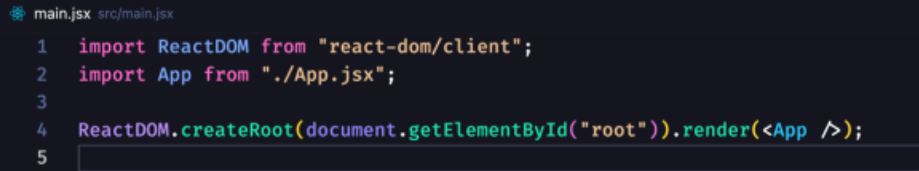

这里我们先暂时忽略 `JSX`，根据之前分析，我们可以写出 `ReactDOM` 对象如下所示：

```javascript
// /core/ReactDOM.js
import React from "./React.js"
const ReactDOM = {
  createRoot(container) {
    return {
      render(app) {
        React.render(app, container)
      }
    }
  }
}
export default ReactDOM
```

然后将之前的 `createElement` 、`createTextNode `和 `render`  等函数移至 `/core/React.js` 文件中

之后我们在 `App.js`  文件中编写如下代码 

```javascript
import React from './core/React.js'
const App = React.createElement('div', { id: 'app' }, 'hello', '-world', '-react')
export default App
```

之后在 `main.js` 文件中引入即可，至此重构工作已经完成

```javascript
import ReactDOM from './core/ReactDOM.js'
import App from './App.js'

ReactDOM.createRoot(document.querySelector('#root')).render(App)
```

## 解析 JSX

平时，如果我们写 React 代码都会使用 `JSX` 语法，而不是使用 `React.createElement` API 进行书写，因此我们这里也需要支持解析 `JSX` 语法。

如果平时我们使用 CDN 快速体验时，需要使用 `babel` 将 `JSX` 代码解析成 `React.createElement` 的形式，这里我们只需要使用 `vite` 即可实现。

通过  `pnpm create vite`  命令使用 `vite` 快速创建一个项目，并将之前的代码拷贝一份过来即可，这里我们暂时还没处理  `Functional Component` 因此，只能先使用以下形式

```jsx
// app.jsx
import React from './core/React.js'
const App = <div id="app">hello<span>-react</span></div>
function AppOne() {
  return <div>this is jsx</div>
}
console.log(AppOne)
export default App
```

同时 `main.js` 修改如下

```javascript
import React from './core/React.js';
import ReactDOM from "./core/ReactDom.js";
import App from "./App.jsx";
ReactDOM.createRoot(document.querySelector("#root")).render(App);
```

如果我们想自定义 React 的名字可以使用以下两种方法

- 使用 `js pragma`

  ```jsx
  // js pragma
  /**@jsx CReact.createElement */
  import CReact from "./core/React.js";
  const App = <div>hi-mini-react</div>;
  ```

  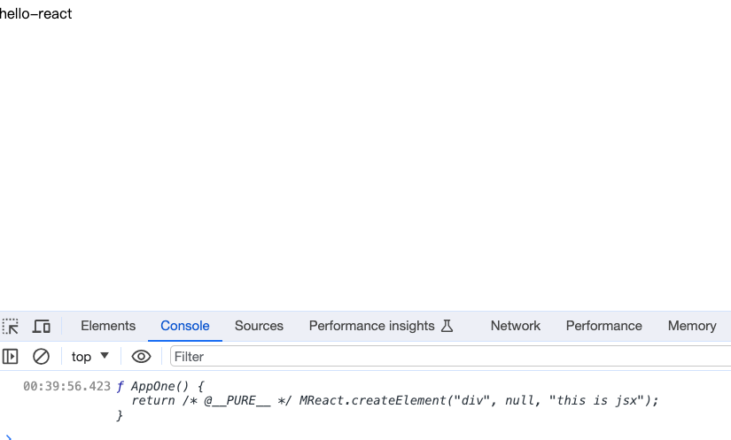

- 配置 `vite esbuild` 配置语法

```js
import { defineConfig } from "vite";

export default defineConfig({
  // https://esbuild.github.io/api/#jsx-factory
  esbuild: {
    jsxFactory: 'MyReact.createElement',
    jsxFragment: 'Fragment',
    jsxInject: `import MyReact from './core/React'`,
  },
})
```

## 实现任务调度器

上述 `render` 函数执行的时候我们可以发现，当 vdom 层级过深时，会一直递归下去。在浏览器中，在浏览器中 GUI 渲染线程和 JS 引擎线程是互斥的。因此，即使在代码中先创建了 DOM 元素，也不会立即呈现到屏幕上，而是等待主线程上的执行完成。从而层级过深会导致渲染卡顿。

为了解决上述问题，我们就需要将一个大任务分成多个小任务进行执行。这里我们采用 [requestIdleCallback](https://developer.mozilla.org/zh-CN/docs/Web/API/Window/requestIdleCallback) 来将任务在浏览器空闲时候进行调用。

模拟过程如下所示：

```javascript
let taskId = 0
function workRun(IdleDeadline) {
  taskId++

  let shouldYield = false
  while (!shouldYield) {
    // run task
    console.log(`taskId: ${taskId} run task`)
    //当前闲置时间没有时，进入到下一个闲置时间执行任务
    shouldYield = IdleDeadline.timeRemaining() < 1
  }
  requestIdleCallback(workRun)
}

requestIdleCallback(workRun)
```

## 实现 fiber 架构

知道上面的原理之后，我们如何做到每次只渲染几个节点，且在下次任务执行的时候依然从之前的位置执行？

这就需要我们将原来的树结构转换为链表，在每个节点中记录 child、sibling、parent 信息，从而在下次执行的任务的时候，通过当前的节点对象找到待执行的节点信息。主要按照以下顺序来判读

- 时候有 child 节点，有则处理 child 节点
- 没有 child 节点，判断是否有 sibling 兄弟节点，如果有则处理 sibling 节点
- 如果都没有，则处理叔叔节点

具体如下面所示：

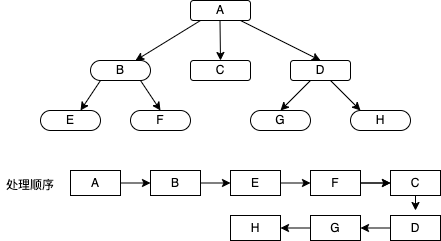

在这里我们实现 `performWorkOfUnit` 函数，在这里我们主要处理以下事件

- 生成 dom，将生成的 dom append 到父元素中
- 处理生成 dom 的 props
- 建立当前节点的链表关系（重难点：`child`、`sibling` 和 `parent`）
- 按照之前所说顺序返回下一个待处理节点，最后可能没有节点，说明已经处理完成，此时需要在 `requestIdleCallback` 函数增加相应的判断，没有节点则结束任务

```js
// core/React.js
let nextWorkOfUnit
function render(el, container) {
  nextWorkOfUnit = {
    dom: container,
    props: {
      children: [el],
    },
  }
}
function createDom(type) {
  return type === TEXT_ELEMENT
    ? document.createTextNode('')
    : document.createElement(type)
}
function updateProps(dom, props) {
  Object.keys(props).forEach((key) => {
    if (key !== 'children') {
      dom[key] = props[key]
    }
  })
}
function initChildren(fiber) {
  const children = fiber.props.children
  let prevChild
  children.forEach((child, index) => {
    const nextFiber = {
      type: child.type,
      props: child.props,
      child: null,
      parent: fiber,
      sibling: null,
    }
    // 处理第一个 child
    if (index === 0) {
      fiber.child = nextFiber
    } else {
      // 将当前节点赋值给上一个相邻节点的兄弟
      prevChild.sibling = nextFiber
    }
    prevChild = nextFiber
  })
}
function performWorkOfUnit(fiber) {
  // 生成 dom
  if (!fiber.dom) {
    const dom = (fiber.dom = createDom(fiber.type))
    // append dom 到 父元素
    fiber.parent.dom.append(dom)
    // 处理 props
    updateProps(dom, fiber.props)
  }
  // 处理 children
  initChildren(fiber)
  // 返回下一个要处理的节点
  // 如果有子节点
  if (fiber.child) {
    return fiber.child
  }
  // 如果有兄弟节点
  if (fiber.sibling) {
    return fiber.sibling
  }
  // 返回叔叔节点
  return fiber.parent?.sibling
}
function workLoop(IdleDeadline) {
  let shouldYield = false
  while (!shouldYield && nextWorkOfUnit) {
    // run task
    nextWorkOfUnit = performWorkOfUnit(nextWorkOfUnit)
    //当前闲置时间没有时，进入到下一个闲置时间执行任务
    shouldYield = IdleDeadline.timeRemaining() < 1
  }
  requestIdleCallback(workLoop)
}

requestIdleCallback(workLoop)
```

## 实现统一提交

当我们使用 `requestIdleCallback`  将渲染任务分成若干个小任务在空闲时间渲染时，可能由于中途没有空余时间，而导致后续节点一直没有渲染，此时用户就会看到渲染出来的部分 dom。

为了解决这个问题就需要我们在生成 dom 的时候不要立即将 dom 添加到父级容器中，而是在任务处理完成后统一进行添加，这样就能进行统一的渲染。这里我们主要在 `nextWorkOfUnit` 为空时，进行统一渲染。逻辑如下所示：

```js
let root = null
function render(el, container) {
  nextWorkOfUnit = {
    dom: container,
    props: {
      children: [el],
    },
  }
  root = nextWorkOfUnit
}
function workLoop(IdleDeadline) {
  //...
  // 对 root 节点只执行一次渲染
  if (!nextWorkOfUnit && root) {
    commitRoot(root)
  }
  requestIdleCallback(workLoop)
}
function commitRoot() {
  commitWork(root.child)
  root = null
}
function commitWork(fiber) {
  if (!fiber) return
  fiber.parent.dom.append(fiber.dom)
  if (fiber.sibling) commitWork(fiber.sibling)
  if (fiber.child) commitWork(fiber.child)
}
```

## 实现 function component

之前我们在 `App.jsx` 文件中并没有写成函数的形式，因为当初我们还不支持该写法，现在我们就开始处理函数组件。

首先在 `App.jsx` 文件中导出一个函数组件，并在浏览器中输出其转换后的信息

```jsx
function Counter() {
  return <div>count</div>
}
function App() {
  return (
    <div id="app">
      <div>hello-mini-react</div>
      <Counter></Counter>
    </div>
  )
}
export default App
```

我们在 `render` 函数中添加以下代码 `console.log(el)` 可以看到此时 `el` 是一个函数，返回值是我们需要的 vdom 结构

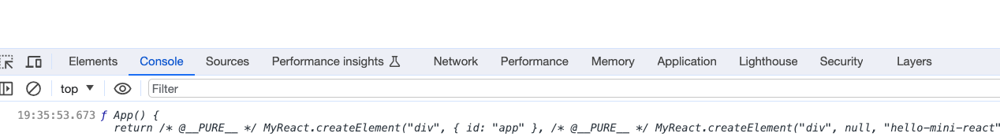

因此我们需要在 `render` 函数中增加对 `el` 函数式组件的判断。

```js
function render(el, container) {
  el = typeof el === 'function' ? el() : el
  console.log(el)
  nextWorkOfUnit = {
    dom: container,
    props: {
      children: [el],
    },
  }
}
```

此时我们可以看到根元素的结构如下所示：

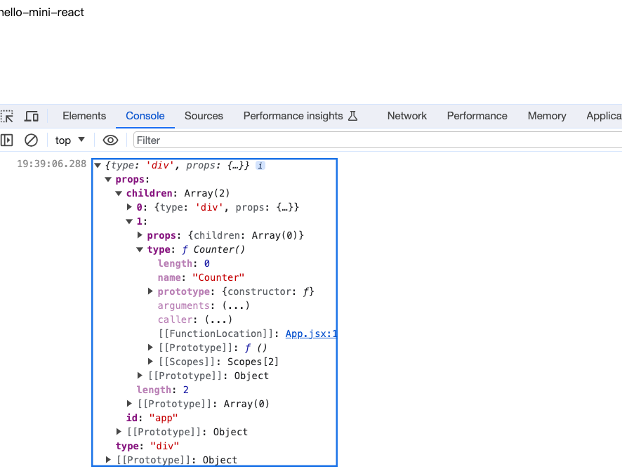

此时页面中除了 `Counter` 组件以为，其他已经可以正常展示，上述 `dom` 结构如下图所示

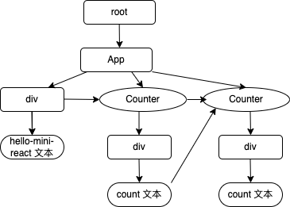

这里 `Counter` 实际上并不需要生成 `dom`，只需处理下面的节点即可，因此我们在 `performWorkOfUnit`  函数中进行如下调整

```js
function performWorkOfUnit(fiber) {
  // 新增 FC 判断 
  const isFunctionComponent = typeof fiber.type === 'function'
  // 函数式组件不用生成 dom
  if (!isFunctionComponent) {
    // 生成 dom
    if (!fiber.dom) {
      const dom = (fiber.dom = createDom(fiber.type))
      // 处理 props
      updateProps(dom, fiber.props)
    }
  }
  
  // 处理 children 函数式组件需要单独处理
  const children = isFunctionComponent ? [fiber.type()] : fiber.props.children
  initChildren(fiber, children)
  // ....
}
function initChildren(fiber, children) {
  // 移除这段 const children = fiber.props.children
}
```

此时我们可以页面将 `Counter` 内容渲染成了 `undefined`，同时浏览器报错如下所示：

```js
React.js:113 Uncaught TypeError: Cannot read properties of undefined (reading 'append')
    at commitWork (React.js:113:20)
    at commitWork (React.js:114:20)
    at commitWork (React.js:115:22)
    at commitWork (React.js:114:20)
    at commitRoot (React.js:108:3)
    at workLoop (React.js:103:5)
```

这是因为 `commitWork` 函数中添加 `dom`  的时候 `Counter`  并没有 dom，需要继续向上找到 `App` 节点进行挂载，此时修改代码如下所示

```js
function commitWork(fiber) {
  if (!fiber) return
  let fiberParent = fiber.parent
  // 如果父级没有 dom 函数值组件
  if (!fiberParent.dom) {
    fiberParent = fiberParent.parent
  }
  fiberParent.dom.append(fiber.dom)
  if (fiber.child) commitWork(fiber.child)
  if (fiber.sibling) commitWork(fiber.sibling)
}
```

此时我们发现页面不仅渲染出了 `Counter` 组件，还多渲染了 `undefined`，这是当 `fiber.dom` 不存在的时候我们仍然将其添加到了父级元素中，因此需要新增如下判断。

```js
if (fiber.dom) fiberParent.dom.append(fiber.dom)
```

这时我们可以看到页面渲染正常了，这里父级判断我们只判断了一层，如果函数式组件嵌套使用的时候，则页面渲染同样会出现 `Uncaught TypeError: Cannot read properties of undefined (reading 'append')` 的错误。

```js
function CounterContainer() {
  return <Counter></Counter>
}
function App() {
  return (
    <div id="app">
      <div>hello-mini-react</div>
      <CounterContainer />
      {/* <Counter></Counter> */}
    </div>
  )
}
export default App
```

因此，在 `commitWork` 函数这里我们不能只使用 `if` 判断，而是递归寻找直至找到有 `dom` 元素的节点

```js
// 如果父级没有 dom 函数值组件
while (!fiberParent.dom) {
  fiberParent = fiberParent.parent
}
```

如果我们在这里同时引用两个函数式组件，会正常渲染嘛？

```jsx
function Counter() {
  return <div>count</div>
}
function App() {
  return (
    <div id="app">
      <div>hello-mini-react</div>
      <Counter></Counter>
      <Counter></Counter>
    </div>
  )
}
export default App
```

我们发现页面只会渲染出一个 `count`，由之前展示的 `dom` 结构图可知，在第一个 `Counter` 组件渲染之后，它要找到下一个需要渲染的 `Counter` 组件，这时渲染的文本节点没有 `child` 和 `sibling` 节点，需要找到 `Counter` 的 `sibling` 节点，而我们现在在上面判断之后返回的是 `fiber.parent?.sibling` 这个只会找到 `div` 并没有到 `Counter` 节点，因此需要修改成下面形式, 此时页面即可正常展示

```js
function performWorkOfUnit(fiber) {
  //...
  // 返回下一个要处理的节点
  // 如果有子节点
  if (fiber.child) {
    return fiber.child
  }
  let nextFiber = fiber
  while (nextFiber) {
    // 如果有兄弟节点
    if (nextFiber.sibling) {
      return nextFiber.sibling
    }
    nextFiber = nextFiber.parent
  }
}
```

我们的函数式组件可以接受 `props`， 我们修改 `App.jsx` 如下

```jsx
function Counter({ num }) {
  return <div>count: { num }</div>
}
function App() {
  return (
    <div id="app">
      <div>hello-mini-react</div>
      <Counter num={1}></Counter>
      <Counter num={2}></Counter>
    </div>
  )
}
export default App

```

此时页面会报错如下所示

```js
App.jsx:1 Uncaught TypeError: Cannot destructure property 'num' of 'undefined' as it is undefined.
    at Object.Counter [as type] (App.jsx:1:27)
    at performWorkOfUnit (React.js:80:49)
    at workLoop (React.js:100:22)
```

此时经过断点我们可以发现，在调用 `fiber.type()` 函数的时候报错，因为函数接收参数，而我们却没有传递

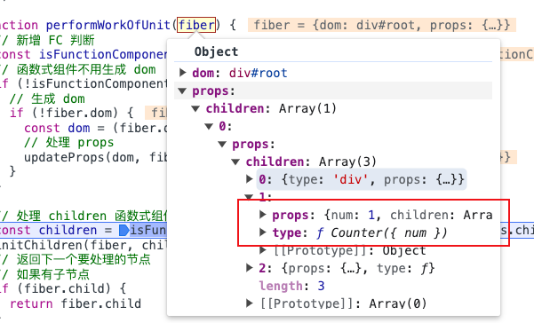

因此我们需要将 `fiber.props` 进行传入，这时我们可以看到页面报错如下所示：

```js
React.js:40 Uncaught TypeError: Cannot convert undefined or null to object
    at Function.keys (<anonymous>)
    at updateProps (React.js:40:10)
    at performWorkOfUnit (React.js:75:7)
    at workLoop (React.js:100:22)
```

此时我们断点可以发现 `fiber.type(fiber.props)` 调用返回如下所示，

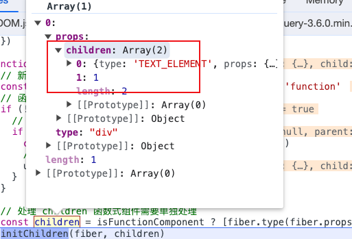

可以看到 `children` 有一个 `child` 是数字，我们在之前只处理了 `string` 没有处理 `number` 类型，因此我们需要在 `createElement` 中对 `children` 处理如下所示

```js
function createElement(type, props, ...children) {
  return {
    type,
    props: {
      ...props,
      children: children.map((child) => {
        const isTextNode = typeof child === 'string' || typeof child === 'number'
        return isTextNode ? createTextNode(child) : child
      }),
    },
  }
}
```

这时我们的页面即可正常展示，同理 `boolean` 类型等可以做类似处理

## 重构 function component 代码

我们可以将函数式组件的渲染和普通组件渲染代码分别提取出来，便于后续维护和阅读

```js
// 处理函数式组件
function updateFunctionComponent(fiber) {
  // 函数式组件不用生成 dom
  const children = [fiber.type(fiber.props)]
  initChildren(fiber, children)
}
// 处理普通组件
function updateHostComponent(fiber) {
  // 生成 dom
  if (!fiber.dom) {
    const dom = (fiber.dom = createDom(fiber.type))
    // 处理 props
    updateProps(dom, fiber.props)
  }
  // 处理 children 函数式组件需要单独处理
  const children = fiber.props.children
  initChildren(fiber, children)
}
function performWorkOfUnit(fiber) {
  // 新增 FC 判断 
  const isFunctionComponent = typeof fiber.type === 'function'
  if (isFunctionComponent) {
    updateFunctionComponent(fiber)
  } else {
    updateHostComponent(fiber)
  }

  // 返回下一个要处理的节点
  // 如果有子节点
  if (fiber.child) {
    return fiber.child
  }
  let nextFiber = fiber
  while (nextFiber) {
    // 如果有兄弟节点
    if (nextFiber.sibling) {
      return nextFiber.sibling
    }
    nextFiber = nextFiber.parent
  }
}
```

## 实现事件绑定

我们先在组件上绑定一个时间，看看 `jsx` 转换后的代码是什么样的，代码修改如下：

```jsx
function Counter({ num }) {
  function handleClick() {
    console.log('click')
  }
  return (
    <div>
      count: {num} <button onClick={handleClick}>click</button>
    </div>
  )
}
```

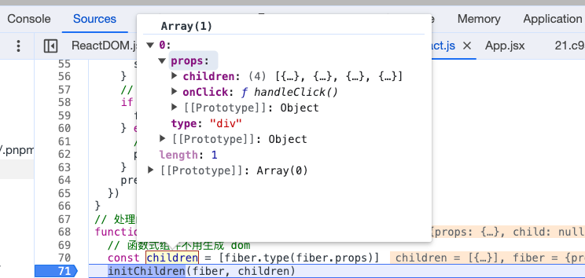

解析后如下所示，因此我们可以在处理 `props`  的时候，通过判断属性是否以 `on` 开头来处理事件，我们将 `updateProps`  函数修改成如下代码

```js
function updateProps(dom, props) {
  Object.keys(props).forEach((key) => {
    if (key !== 'children') {
      // 是否是事件
      if (key.startsWith('on')) {
        const eventType = key.slice(2).toLowerCase()
        dom.addEventListener(eventType, props[key])
      } else {
        dom[key] = props[key]
      }
    }
  })
}
```

## 实现更新 props

我们要实现 `props` 的更新，首先要在获取新的 `dom` 树的同时可以获取到先前的 `dom` 树，然后在相同的节点下对比 `props` 的差异，从而完成更新。

首先我们要怎么获取新的 `dom` 树，我们在渲染的时候调用了 `commitRoot` 函数，在这里我们将最后渲染的 `root` 节点清空，这个渲染的 `root` 节点就是我们后需要更新的 `dom` 树。因此，我们需要一个变量将其保存起来，更新时，在这个 `dom` 上进行对比更新。

```js
let currentRoot = null
function commitRoot() {
  commitWork(root.child)
  // 保存渲染后的 dom 树
  currentRoot = root
  root = null
}
// 新增 update 函数
function update() {
  nextWorkOfUnit = {
    dom: currentRoot.dom,
    props: currentRoot.props,
  }
  root = nextWorkOfUnit
}
```

我们获取了最新 `dom` 那么如何找到对应的老节点呢，这就需要我们在新节点上有一个指针可以指向之前的老节点，如图所示：

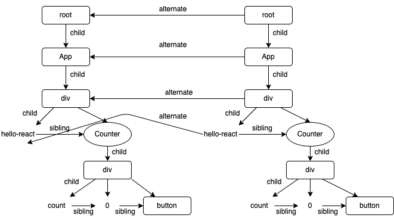

我们在 `update` 函数中 `nextWorkOfUnit`  新增 `alternate` 属性指向之前的 `dom`，然后在 `initChildren` 函数中进行相应的节点关联，主要代码如下所示：

```js
function initChildren(fiber, children) {
  let oldFiber = fiber.alternate?.child
  let prevChild
  children.forEach((child, index) => {
    const isSameType = oldFiber && oldFiber.type === child.type
    let nextFiber
    // 如果是同一种类型 说明是 update,此时不用在重新创建 dom
    // 增加 effectTag 从而在 commitWork 中判断是更新还是新增，这里更新我们暂时处理props
    if (isSameType) {
      nextFiber = {
        type: child.type,
        props: child.props,
        child: null,
        parent: fiber,
        sibling: null,
        dom: oldFiber.dom,
        alternate: oldFiber,
        effectTag: 'update',
      }
    } else {
      nextFiber = {
        type: child.type,
        props: child.props,
        child: null,
        parent: fiber,
        sibling: null,
        dom: null,
        effectTag: 'placement',
      }
    }
    // 更新 oldFiber 从而与最新的节点保持对应关系
    if (oldFiber) {
      oldFiber = oldFiber.sibling
    }

    // 处理第一个 child
    if (index === 0) {
      fiber.child = nextFiber
    } else {
      // 将当前节点赋值给上一个相邻节点的兄弟
      prevChild.sibling = nextFiber
    }
    prevChild = nextFiber
  })
}
```

然后我们在  `commitWork` 函数中判断如果是更新，则只需要调用 `updateProps` 函数即可。

```js
function commitWork(fiber) {
  //...
  // 更新 props
  if (fiber.effectTag === 'update') {
    updateProps(fiber.dom, fiber.props, fiber.alternate.props)
  } else if (fiber.effectTag === 'placement') {
    // 新增
    if (fiber.dom) fiberParent.dom.append(fiber.dom)
  }

  commitWork(fiber.child)
  commitWork(fiber.sibling)
}
```

而 `updateProps`  则需要调整一下接收待更新和以前的 `props` ，按照以下规则尽心更新

- 老得 `props` 有，新的 `props`  没有，则删除
- 老得 `props` 没有，新的 `props` 有，则新增
- 老得 `props` 有，新的 `props` 有，且值不相等，则修改
- 注意：相同事件名称更新时，需先移除掉老的事件

同时这里的 `root` 无法明确具体代表什么，实际上是正在处理的 `root` (work in progress)，因此我们将其重新命名为 `wipRoot`，同时 `initChildren` 这个名称也并不是很恰当，我们与 `React` 中对齐，将其重命名为 `reconcile`

## diff - 更新 children

上一步骤我们对相同类型进行了更新，当 `type` 不一致时，就需要我们对老得节点进行删除，因此我们需要声明一个变量 `deletions` 来保存需要删除的节点信息，并在 `commitRoot` 函数中进行调用删除。

```js
// 待移除 dom 元素数组
let deletions = []
function commitRoot() {
  deletions.forEach(commitDeletions)
  commitWork(wipRoot.child)
  // 清空 deletions 数组
  deletions = []
  // 保存渲染后的 dom 树
  currentRoot = wipRoot
  wipRoot = null
}
function commitDeletions(fiber) {
  fiber.parent.dom.removeChild(fiber.dom)
}
```

这时我们修改 `App.jsx`  代码如下所示，来检测是否可以正常删除

```jsx
let isFoo = false
function Counter({ num }) {
  const Foo = <span>foo</span>
  const Bar = <p>Bar</p>
  function handleClick() {
    isFoo = !isFoo
    console.log('click')
    React.update()
  }
  return (
    <div>
      component:
      <div>{isFoo ? Foo : Bar}</div>
      <button onClick={handleClick}>click</button>
    </div>
  )
}
```

经过测试此时页面能正常将老节点删除，当我们将 `Bar` 改为函数式组件时

```jsx
function Bar() {
	return <p>Bar</p>
}
```

可以看到页面报如下错误

```js
React.js:98 Uncaught TypeError: Failed to execute 'removeChild' on 'Node': parameter 1 is not of type 'Node'.
    at commitDeletions (React.js:98:20)
    at Array.forEach (<anonymous>)
    at commitRoot (React.js:89:13)
    at workLoop (React.js:53:5)
```

这是因为函数式组件生成的 vdom 对象上没有 `dom` 因此我们需要删除的是其 `child.dom` 元素，同时如果是修改函数式组件的内部 `dom`， 其 `parent` 不存在，因此需要递归向上寻找。或者调用 `dom.remove` 方法 将节点从其所属 `DOM` 树中删除

```js
function commitDeletions(fiber) {
  // 有 dom 元素 直接删除
  if (fiber.dom) {
    // 因为可能是函数式组件内部的 dom，其 parent 不存在，因此需要递归向上寻找
    let fiberParent = fiber.parent
    // 如果父级没有 dom 函数值组件
    while (!fiberParent.dom) {
      fiberParent = fiberParent.parent
    }
    fiberParent.dom.removeChild(fiber.dom)
    // 方法2 调用 dom.remove 方法 将节点从其所属 DOM 树中删除
    // fiber.dom.remove()
  } else {
    // 没有 dom 元素即函数式组件，则处理其 child
    commitDeletions(fiber.child)
  }
}
```

## diff - 删除多余的老节点

当我们需要更新的节点一方多，一方少时，我们可以发现在切换时候，多余的老节点并不会被删除

```js
const foo = (
    <div>
      Foo
      <div>foo-child</div>
    </div>
  )
  const bar = <div>Bar</div>
```

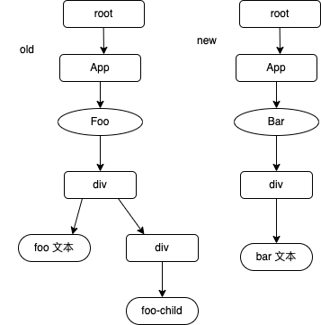

由上图关系可知，我们在处理完最后一个子节点时，需要获取其对应的老节点，从而找到老节点的兄弟节点，然后将该兄弟节点删除即可。即 `bar文本`  —>  `foo 文本` —> `兄弟节点 div 删除`

因此我们可以在最后处理的节点的时候将老节点添加到 `deletions` 数组中，从而完成删除

在 `reconcile` 函数中，我们用来处理组件的子节点，且每次更新了 `oldFiber = oldFiber.sibling`，因此在组件更新完子节点时候，如果 `oldFiber` 还有值，则说明这是个多余的老旧节点，需要删除，且因为多余的节点不止一个，因此我们需要循环进行遍历。

```js
function recocile(fiber, children) {
	// ...
	// 如果 oldFiber 仍然有值，说明是老旧节点，需要删除
  while (oldFiber) {
    deletions.push(oldFiber)
    // 可能存在多个老旧节点
    oldFiber = oldFiber.sibling
  }
}
```

  
